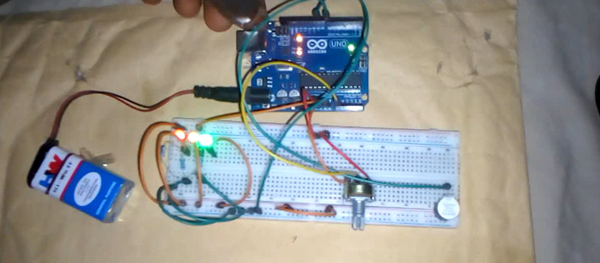

# Potentiometer Controlled LED – Arduino Project

## Overview
This project demonstrates how to control the brightness of an LED using a potentiometer. It introduces analog input and PWM output on the Arduino.

## Objective
- Learn how to read analog input values with `analogRead()`
- Control LED brightness using PWM (`analogWrite()`)
- Understand the mapping of input ranges to output ranges
- Gain experience with real-time input-output control

## Components Used
- Arduino Uno
- LED
- 220Ω resistor
- Potentiometer
- Breadboard
- Jumper wires
- 9V Battery
- 9V Battery Clip to DC Barrel Jack
- Active Buzzer

## Circuit Diagram

## How It Works
1. The potentiometer is connected to an analog input pin on the Arduino.
2. The Arduino reads the voltage value from the potentiometer using `analogRead()`.
3. This value is mapped to a range suitable for PWM output (0–255) using `map()`.
4. The LED pin is set as an OUTPUT using `pinMode()`.
5. The LED brightness is controlled by writing the mapped value to the pin using `analogWrite()`.
6. The loop continuously updates the LED brightness as the potentiometer is turned.

## Code
The Arduino sketch for this project is located in the [code/ directory](code/led_light_potentiometer_controlled_project.ino).

## Demo Video
A demonstration video showing the working project is included in this repository.

📹 **Project Demonstration:**  
[Click here to watch/download the demo video](video/potentiometer_controled_video_1.mp4)

*(If the video does not preview directly on GitHub, please download it using the link above.)*

## Reflection (What I Learned)
- How analog input works with Arduino
- Controlling LED brightness with PWM
- Mapping input ranges to output ranges
- Real-time hardware interaction and response

## Challenges Faced
- Correctly wiring the potentiometer to read values accurately
- Understanding how `analogRead()` values map to PWM output
- Preventing flickering of the LED at low PWM values

## Possible Improvements
- Implement smooth fading effects
- Add a display to show the analog value numerically

## Project Status
Completed
